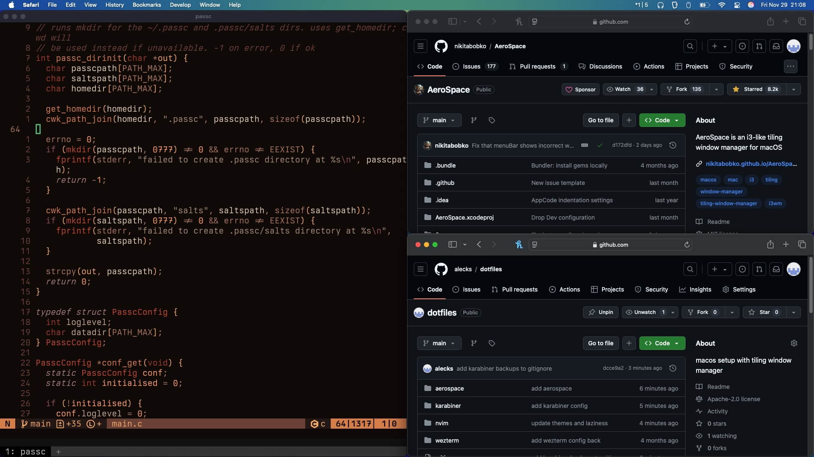

# dotfiles

Dotfiles for my personal Mac and my university's DICE computers. 

Designed to be installed using GNU [stow](https://www.gnu.org/software/stow/).

## Shared

- basic [neovim](https://neovim.io) config based on kickstart
- [wezterm](https://wezfurlong.org/wezterm) with [Berkeley Mono](https://berkeleygraphics.com/typefaces/berkeley-mono) typeface

## Mac

- tiling window manager setup with [AeroSpace](https://github.com/nikitabobko/AeroSpace)
- hyperkey with Karabiner

## DICE

- i3 setup
- ~~nix for local package management~~
- [infpi](https://github.com/alecks/infpi) for local package management

