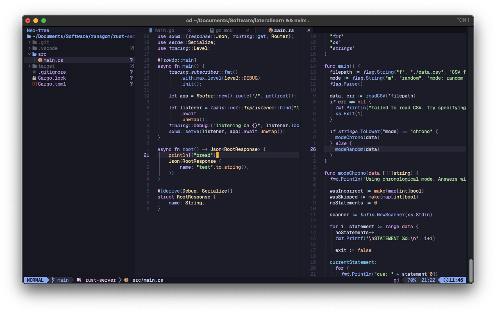

# nvim setup

This is a really basic lazy-nvim setup, pretty much unchanged from the starter repo.

Theme: `catppuccin`

## Installation (if I forget)

- `git clone github.com/alecks/nvim-setup ~/.config/nvim`
- `brew install ripgrep lazygit markdownlint-cli`
