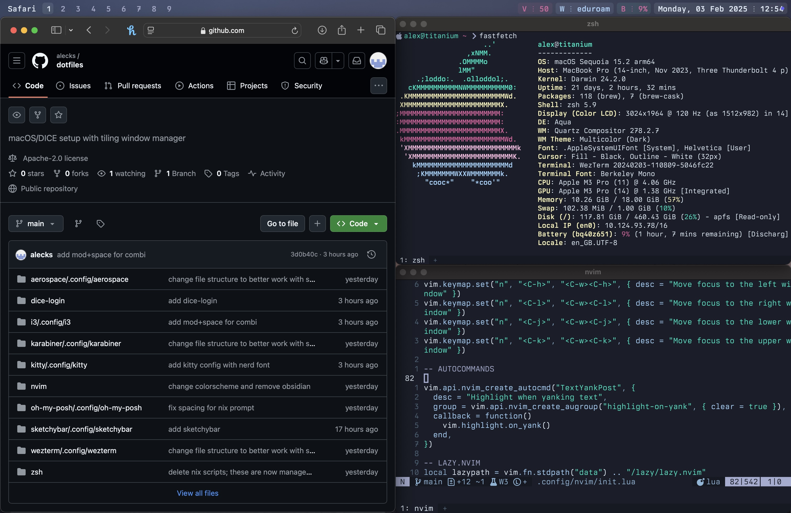

# dotfiles

Dotfiles for my personal Mac and my university's DICE computers. 

## Installation with stow-all

This repository has a `stow-all.sh` script which can be used to install all packages from a `stowlist`. For example, `./stow-all.sh stowlist-dice` will install everything used for DICE.

## Shared

- basic [neovim](https://neovim.io) config based on kickstart
- [wezterm](https://wezfurlong.org/wezterm) with [Berkeley Mono](https://berkeleygraphics.com/typefaces/berkeley-mono) typeface

See `stowlist-shared`.

## Mac

- tiling window manager setup with [AeroSpace](https://github.com/nikitabobko/AeroSpace)
- hyperkey with Karabiner

See `stowlist-mac`.

## DICE

- i3 setup
- ~~nix for local package management~~
- [infpi](https://github.com/alecks/infpi) for local package management

See `stowlist-dice`. The DICE dotfiles are designed to work on an unmodified DICE install, with no extra programs downloaded. Use [infpi](https://github.com/alecks/infpi) to install more programs like a newer version of nvim to work with these dotfiles and oh-my-posh.
