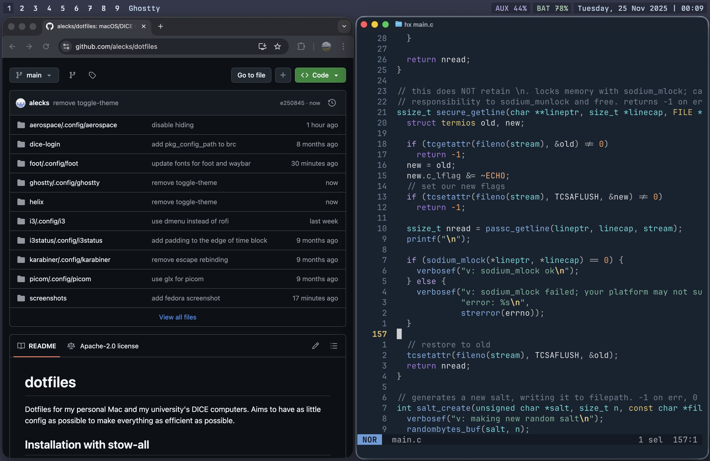
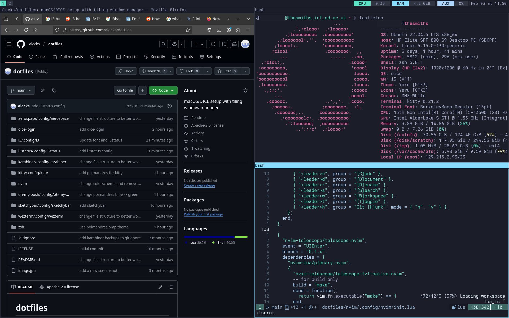

# dotfiles

Dotfiles for my Mac, ThinkPad and my university's DICE computers. Aims to have as little config as possible to make everything as efficient as possible.

## Installation with stow-all

Stow is a GNU tool that can be used to symlink your config from one main folder to the actual locations expected by programs. In other words, it's a way to have one configuration folder with everything in it, and have the ability to pick and choose which configurations to actually use.

This repository has a `stow-all.sh` script which can be used to install configurations from a `stowlist`. For example, `./stow-all.sh stowlist-dice` will install all configurations relevant for DICE.

## Shared

- [Helix](https://helix-editor.com) code editor
- [Ghostty](https://ghostty.org) terminal
- [Berkeley Mono](https://berkeleygraphics.com/typefaces/berkeley-mono) typeface

See `stowlist-shared`.

## Mac (macOS Tahoe)

- [Aerospace](https://github.com/nikitabobko/AeroSpace) tiling window manager
- [SketchyBar](https://github.com/FelixKratz/SketchyBar) status bar
- [JankyBorders](https://github.com/FelixKratz/JankyBorders) for borders between windows
- [Karabiner Elements](http://karabiner-elements.pqrs.org/) for hyperkey with CapsLock

See `stowlist-mac`.

## ThinkPad (Fedora)

ThinkPad T480s running [Arch](https://archlinux.org/).

- [Hyprland](https://hypr.land/) tiling window manager
- [Waybar](https://github.com/Alexays/Waybar) status bar
- [Wofi](https://hg.sr.ht/~scoopta/wofi) application launcher
- [Mako](https://github.com/emersion/mako) notification daemon

## DICE (University)

DICE (Distributed Informatics Computing Environment) is the University of Edinburgh's School of Informatics computer system. It can be configured extensibly despite being an operating system for students on shared computers.

- [i3](https://i3wm.org) window manager, with i3status and [picom](https://picom.app)
- [infpi](https://github.com/alecks/infpi) for local package management, with the ability to use Nix (see dice-login)

See `stowlist-dice`. The DICE dotfiles should work on an unmodified DICE install, with no extra programs downloaded. Picom is optional for less screen tearing, but is a pain to install.
